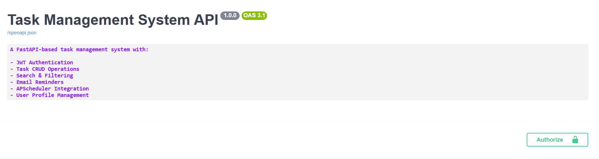

# Task Management System API


## API Documentation Preview




## Overview

Task Management System API is a backend application built with FastAPI that allows users to create, manage, and track tasks efficiently. The system includes secure JWT authentication, task filtering, email notifications, automated reminders, and user profile management.

The project demonstrates modern backend development practices using FastAPI, SQLAlchemy, PostgreSQL, Alembic, APScheduler, and FastAPI-Mail.

---

## Features

### Authentication & User Management

* User Registration
* User Login
* JWT Authentication
* Get User Profile
* Update User Profile
* Change Password

### Task Management

* Create Task
* Get All Tasks
* Get Single Task
* Update Task
* Delete Task

### Task Utilities

* Pagination
* Search Tasks by Title or Description
* Filter Tasks by Status
* Filter Tasks by Priority
* Due Tomorrow Tasks
* Overdue Tasks

### Notifications

* Registration Confirmation Email
* Due Date Reminder Email
* Automated Reminder Scheduling using APScheduler

### System

* Health Check Endpoint
* Interactive Swagger Documentation
* ReDoc Documentation

---

## Tech Stack

* FastAPI
* PostgreSQL
* SQLAlchemy
* Alembic
* JWT Authentication
* APScheduler
* FastAPI-Mail
* Pydantic
* Python

---

## Project Structure

```text
task-management-system/
│
├── alembic/
├── src/
│   ├── task/
│   │   ├── controller.py
│   │   ├── models.py
│   │   ├── ditos.py
│   │   └── router.py
│   │   
│   │
│   ├── user/
│   │   ├── controller.py
│   │   ├── models.py
│   │   ├── ditos.py
│   │   └── router.py
│   │   
│   │
│   ├── scheduler/
│   │   └── reminder_scheduler.py
│   │   
│   │
│   └── utils/
│       ├── db.py
│       ├── helpers.py
│       ├── settings.py
│       └── mail.py
│       
├── images/
│   └── swagger-ui.png
├── main.py
├── requirements.txt
├── README.md
├── alembic.ini
└── .gitignore
```

---

## Installation

### Clone the Repository

```bash
git clone https://github.com/fardeenchawhan/task-management-system.git
cd task-management-system
```

### Create Virtual Environment

```bash
python -m venv venv
```

### Activate Virtual Environment

Windows:

```bash
venv\Scripts\activate
```

Linux / Mac:

```bash
source venv/bin/activate
```

### Install Dependencies

```bash
pip install -r requirements.txt
```

---

## Environment Variables

Create a `.env` file in the project root.

```env
DB_CONNECTION=

SECRET_KEY=
ALGORITHM=

EXPIRY_TIME=

MAIL_USERNAME=
MAIL_PASSWORD=
MAIL_FROM=
```

---

## Database Migration

Run Alembic migrations:

```bash
alembic upgrade head
```

---

## Run the Application

```bash
uvicorn src.main:app --reload
```

Application URL:

```text
http://127.0.0.1:8000
```

---

## API Documentation

Swagger UI:

```text
http://127.0.0.1:8000/docs
```

ReDoc:

```text
http://127.0.0.1:8000/redoc
```

---

## User Endpoints

| Method | Endpoint              |
| ------ | --------------------- |
| POST   | /user/register        |
| POST   | /user/login           |
| GET    | /user/profile         |
| PUT    | /user/profile_update  |
| PUT    | /user/change-password |

---

## Task Endpoints

| Method | Endpoint                   |
| ------ | -------------------------- |
| POST   | /tasks                     |
| GET    | /tasks                     |
| GET    | /tasks/search-task         |
| GET    | /tasks/due-tomorrow        |
| GET    | /tasks/overdue             |
| GET    | /tasks/priority/{priority} |
| GET    | /tasks/status/{status}     |
| GET    | /tasks/{task_id}           |
| PUT    | /tasks/update/{task_id}    |
| DELETE | /tasks/delete/{task_id}    |

---

## Health Check

| Method | Endpoint |
| ------ | -------- |
| GET    | /health  |

---

## Authentication

The API uses JWT Bearer Authentication.

After login, include the access token in the Authorization header:

```http
Authorization: Bearer <your_access_token>
```

You can also authorize directly through Swagger UI using the **Authorize** button.

---

## Automated Email Reminders

The application uses APScheduler to automatically send reminder emails for tasks that are due the next day.

Reminder emails are sent only once per task using the `reminder_sent` flag.

---

## Future Improvements

- Redis Caching for Frequently Accessed Data
- Role-Based Access Control (RBAC)

---

## Author

**Fardeen Chawhan**
